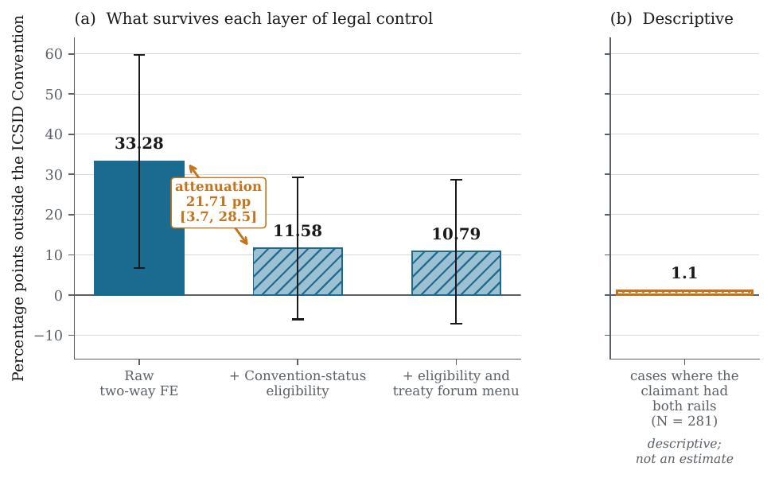
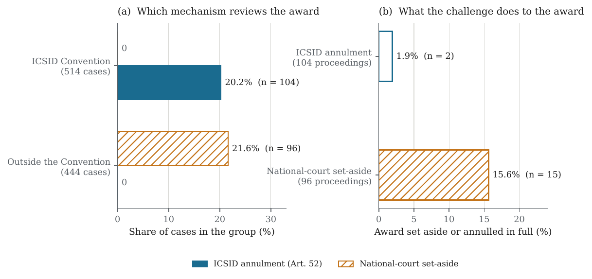

# When the Rails Switch

**Replication code for _"When the Rails Switch: Financial-Infrastructure Fragmentation under Geoeconomic Sanctions and the Reconfiguration of International Investment Arbitration"_**

[Your Name] · Accepted for presentation at the 2026 Taipei International Conference on Arbitration and Mediation (CAA / ACWH, NTU College of Law, 20–21 October 2026), Session III: *The Variety of Disputes and International Dispute Resolution*.

  

---

## The question

Financial sanctions are fragmenting payment and settlement networks along geopolitical lines. Have the *legal* rails of investor–State dispute settlement fragmented with them — that is, do disputes against sanctioned States move away from the ICSID Convention's self-contained enforcement regime and into the seat-based regime of national-court set-aside and New York Convention recognition?

The paper links **958 treaty-based disputes** (UNCTAD ISDS Navigator, 2010–2023, 125 respondent States) to the **Global Sanctions Data Base**, and adds a variable absent from existing ISDS datasets: whether the ICSID Convention was actually open to the parties, on Contracting-State status grounds, when each claim was filed.

## What the evidence shows

| | Estimate | Reading |
|---|---|---|
| Sanctions and the **number** of disputes | IRR 1.13, 95% CI [0.64, 2.84] | No precisely estimated effect; far too wide to establish equivalence |
| Share of disputes **outside the ICSID Convention** | 60.1% (sanctioned) vs 45.2% (other) | A large descriptive gap |
| Two-way fixed-effects association | +33.28 pp (s.e. 13.53) | Significant on conventional CR1 (p = .015) only |
| Same, with few-cluster inference | cluster-jackknife p = .154 | **Not robust** with 12 switching States |
| After controlling for Convention-status eligibility | +11.58 pp | Not distinguishable from zero |
| **Attenuation** | **21.71 pp, bootstrap CI [3.7, 28.5]** | The precisely estimated quantity |
| Where claimants had *both* rails available (N = 281) | 23.1% vs 22.0% UNCITRAL use | The gap disappears (descriptive) |

The apparent "sanctions effect" on forum is largely **inherited legal structure** — Convention membership and treaty consent fixed years before sanctions arrived — rather than a behavioural response. The single dominant source is Venezuela, which denounced the Convention in 2012, five years before its sanctions onset. The paper calls this pattern *asynchronous fragmentation*: payment rails can switch within months; the review regime governing an award was set decades earlier.

<p align="center">
  
</p>

<p align="center"><sub><b>Figure.</b> The estimate falls from +33.28 to +11.58 pp once Convention-status eligibility is controlled; among cases where the claimant had both rails available, the descriptive gap is 1.1 pp.</sub></p>

The legal consequence is visible after the award. Across all 958 cases the forum coding reproduces the legal dichotomy without a single exception — all 104 ICSID Article 52 annulment proceedings arise from Convention cases, all 96 national-court set-aside applications from non-Convention cases:

<p align="center">
  
</p>

## Methods

The contribution is methodological discipline applied to a legal question, not a new estimator. The design has only **12 switching respondent States (146 identifying cases)**, so conventional clustered inference is unreliable, and every inferential choice is made explicit:

- **Few-treated-cluster inference.** CR1 alongside a cluster jackknife (CV3) and a restricted wild cluster bootstrap-*t* with Webb six-point weights (B = 1,999), which avoids the 2¹² floor on Rademacher draws with 12 clusters.
- **Permutation diagnostics.** Three schemes — full, restricted, and a timing-only permutation that holds fixed *which* States are sanctioned and reassigns only *when*.
- **Paired cluster bootstrap for the attenuation**, so the difference between two estimates on the same clusters is inferred directly rather than from two separate intervals.
- **Unsettled treaty law as measured uncertainty.** The status of 55 claims filed after an ICSID denunciation is contested under Article 72. Rather than impose a reading, the code reports an interpretive range across strict, permissive, country-level and 1,000 case-level mixed codings, with Imbens–Manski bands on its endpoints.
- **Count outcomes.** Wooldridge (2023) extended two-way fixed-effects Poisson for incidence, with a quasi-separation guard. The guard caught an artefact that had reversed an earlier headline (IRR 2.65 → 1.13): five States in the 2011 cohort had no pre-onset disputes, so their cohort effect was unidentified.
- **Sensitivity.** Rambachan–Roth relative-magnitude bounds on parallel trends; Cinelli–Hazlett omitted-variable bounds benchmarked on eligibility itself; a 224-specification curve with joint permutation inference; Romano–Wolf correction for the moderation family.
- **Legal measurement.** A 171-State ICSID Contracting-Party reference table transcribed from the official ICSID/3 list, and a one-sided falsification test of the eligibility coding (a case that proceeded under the Convention cannot have been coded "closed"), which cut violations from 9 to 2.

The fixed-effects engine, bootstrap and permutation routines, and partial-identification bounds are implemented directly in NumPy/SciPy rather than through a regression package, with a QR-cached projection so the 224-specification curve can be re-estimated under every permutation draw.

## Repository structure

```
when-the-rails-switch/
├── src/                 32 Python modules (see docs/PIPELINE.md for the full map)
│   ├── u00_common.py … u10_paper_tables.py   main estimation pipeline
│   ├── run_upgrade.py                         runs u01–u10 in order
│   ├── build_exhibits.py                      paper figures and summary tables
│   ├── legal_eligibility.py, r26_…            ICSID eligibility coding and audit
│   ├── r22_…, r23_…, r25_…                     eligibility decomposition, parallel claims, treaty menus
│   └── r12_…, r13_…, r14_…, h4_…, h4b_…        supply channel and alternative rails (§7–§8)
├── data/                publishable inputs only — see data/README.md
├── results/             CSV output of the pipeline, as reported in the paper
│   └── supporting/      outputs of the §3.4, §7 and §8 modules
├── figures/             paper figures (vector PDF)
├── tables/              paper tables (LaTeX fragments)
└── docs/                PIPELINE.md, figure previews
```

## Reproducing the results

```bash
pip install -r requirements.txt
```

**From the data in this repository alone** — the core routing results, which are the paper's central findings:

```bash
python src/u01_icsid_reference.py                       # rebuild the ICSID reference table
python src/u03_core_table.py --out outputs              # core table: five inference procedures
python src/u04_interpretive_bounds.py --out outputs     # Article 72 interpretive range
python src/u05_influence.py --out outputs               # leave-one-State-out
python src/u06_event_study.py --out outputs             # event study, BJS, Rambachan–Roth
python src/u07_ovb_sensitivity.py --out outputs         # Cinelli–Hazlett bounds
python src/u08_spec_curve.py --out outputs              # 224-specification curve
python src/u10_paper_tables.py --in outputs --out outputs/tables
python src/build_exhibits.py --results results --cases data/cases_with_navigator.parquet \
    --cohorts data/derived/gsdb_treatment_cohorts.csv \
    --icsid data/reference/icsid_convention_status_icsid3.csv --src src
```

Run all commands from the repository root. Output goes to `outputs/` so it can be compared with the committed `results/`. The full bootstrap and permutation settings are computationally heavy; `u03` accepts `--B-wcb`, `--B-perm` and `--B-boot`, `u04` accepts `--R`, `u06` accepts `--n-draw` and `u08` accepts `--B` for a quick check. Point estimates, CR1 and jackknife results do not depend on these settings.

**Steps requiring inputs that cannot be redistributed** (see [data/README.md](data/README.md)):

| Step | Needs |
|---|---|
| `u02_gsdb_treatment.py` — rebuild treatment cohorts | Global Sanctions Data Base (free on request from its authors) |
| `u09_incidence_etwfe.py` — incidence | country–year panel |
| `r22`, `r23`, `r25` — eligibility decomposition, parallel claims, treaty menus | country–year panel; `r25 --stage worklist` also needs the UNCTAD Navigator Excel release |
| `r12`, `r13`, `r14`, `h4`, `h4b` — §7–§8 | country–year panel |

## Verification

This repository was checked in two ways before release.

1. **Reproduction.** Every script in the "from this repository alone" list was run from a clean copy containing only the files in this repository. Against the committed `results/`, the deterministic quantities reproduce to within 10⁻¹³: the core table (effects, CR1 and jackknife standard errors and p-values, all sample counts), the leave-one-State-out estimates, the event-study coefficients, and the omitted-variable bounds. `u01` rebuilds the ICSID reference table with zero date disagreements, and every numeric cell of the tables regenerated by `u10` matches the committed tables. Bootstrap and permutation p-values vary with the number of draws, as they should. With the full inputs, the supporting modules reproduce the paper's §3.4 falsification result, both §7 supply-channel margins and the §8 Romano–Wolf family exactly; their outputs are in `results/supporting/`. [docs/PIPELINE.md](docs/PIPELINE.md) lists the reproduction status of every table and figure.
2. **Translation.** The code was originally commented in Chinese. Each file was translated to English and then verified by an automated check that compares its abstract syntax tree with the original after normalising string contents, so that only comments, docstrings and messages could differ. All 32 modules pass: the program logic is exactly the code that produced the paper's numbers.

## Notes and known limitations

- **Treatment definition in §7–§8.** The supply-channel and alternative-rails modules (`r12`, `r13`, `r14`, `h4`, `h4b`) construct treatment from the legacy intensity index (`sanction_fin_norm_it ≥ 0.10`, set in `config.py`), whereas the rest of the paper uses the reference definition (at least two Western sanctioning jurisdictions). Both sections report nulls, so no conclusion depends on it, but the two sections are not estimated on the same treatment as the core results.
- **Outcome label in §7.** The forum-margin outcome in `r14` is *non-ICSID* (neither the Convention nor the Additional Facility, 395 cases), while the paper's §7 describes it as the non-Convention outcome (444 cases). The reported estimate (−4.6 pp, p = .610) is correct for the non-ICSID outcome.
- **Parallel claims (Table 13).** The baseline and collapsed rows are reproduced by `r23`'s logic under the reference definition, but `r23`'s command line uses the legacy index, and the rows excluding the Crimea claims, with inverse group-size weights, and excluding all parallel groups come from a computation not included in this repository.
- **Treatment is absorbing.** Onset is coded as permanent. For eleven of the twelve switching States the threshold is met in every post-onset year; Tanzania falls below it in 2016–2020. Coding treatment as contemporaneously in force leaves the headline essentially unchanged (33.67 vs 33.28 pp) and the attenuation present (19.2 vs 24.4 pp); this is reported in the paper.
- **`tables/tab_u_specjoint.tex`** was finalised by hand to add the eligibility-controlled subset rows from `results/tab_spec_curve_joint.csv`; `u10` generates the full-curve rows only. Some other tables carry shortened row labels relative to the `u10` output; every number is identical.
- **Module names** keep their original prefixes so that they match the paper's appendix: `u0x` are pipeline steps, `r2x` audit and robustness modules, `h4x` hypothesis modules. A few docstrings retain remarks from earlier versions of the analysis; they are historical and do not affect any result.
- The routing estimand is conditional on a dispute being **publicly observed**. Non-ICSID proceedings are disclosed later and less completely than ICSID proceedings, and year fixed effects cannot correct outcome-dependent missingness.

## Citation

```bibtex
@inproceedings{rails_switch_2026,
  author    = {[Your Name]},
  title     = {When the Rails Switch: Financial-Infrastructure Fragmentation under
               Geoeconomic Sanctions and the Reconfiguration of International
               Investment Arbitration},
  booktitle = {2026 Taipei International Conference on Arbitration and Mediation},
  address   = {Taipei},
  year      = {2026},
  note      = {Session III: The Variety of Disputes and International Dispute Resolution}
}
```

See also [CITATION.cff](CITATION.cff).

## License

Code is released under the MIT License ([LICENSE](LICENSE)). Data files are subject to the terms of their original sources, described in [data/README.md](data/README.md); the MIT License does not extend to them.
